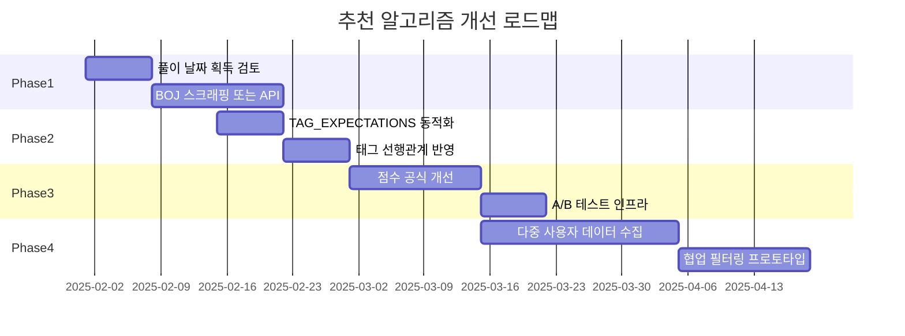

# 추천 문제 알고리즘 개선 계획

## 1. 현재 상태 분석

### 1.1 기존 추천 엔진 ([server/recommendation-engine.ts](server/recommendation-engine.ts))

| 구성 요소 | 현재 구현 | 한계점 |
|-----------|-----------|--------|
| **데이터 소스** | solved.ac API만 사용 | 풀이 날짜 미제공, BOJ 직접 데이터 없음 |
| **약점 분석** | Coverage, Level Gap, Recency, Ceiling, Consistency | Recency는 풀이 날짜 없어 부정확 |
| **추천 카테고리** | weakness, challenge, review, popular, foundation | 5개 고정 |
| **점수 계산** | 휴리스틱 가중치 (30% 태그, 25% 난이도 등) | 하드코딩된 TAG_EXPECTATIONS |
| **문제 검색** | solvedac.searchProblems (tag, levelMin, levelMax) | sort: solved 고정, 제한적 필터 |

### 1.2 사용 가능한 데이터 소스

| 소스 | 제공 데이터 | 제한사항 |
|------|-------------|----------|
| **solved.ac API** | 사용자 프로필, 풀이 목록, 문제 상세, 태그, 난이도, acceptedUserCount | 풀이 날짜 없음, rate limit ~100/분 |
| **BOJ (acmicpc.net)** | 제출 이력(웹 스크래핑 가능) | 공식 API 없음, 풀이 날짜는 제출 이력에서 추출 가능 |
| **다른 사이트** | AtCoder, Codeforces | 별도 API, BOJ 문제와 매핑 어려움 |

---

## 2. 알고리즘 개선 방향

### 2.1 Phase 1: 데이터 품질 강화 (단기)

**목표**: 풀이 날짜 획득으로 Recency 정확도 향상

```
[BOJ 제출 이력 스크래핑] → [풀이 날짜 추출] → [user_problem_status.solvedAt 업데이트]
```

- **방법**: BOJ status 페이지 (`/status?user_id={handle}`) 또는 solved.ac 연동 데이터 확인
- **solved.ac API**: `search/problem?query=solved_by:{handle}` 결과에 날짜 포함 여부 확인
- **대안**: 사용자가 수동으로 "최근 푼 문제" 입력, 또는 동기화 시점을 proxy로 사용 (현재 방식)

**구현 파일**: `server/sync.ts`, `server/solvedac.ts` (또는 `server/boj-scraper.ts` 신규)

---

### 2.2 Phase 2: 약점 분석 고도화 (단기)

**목표**: 하드코딩 제거, 데이터 기반 기대치 산출

| 개선 항목 | 현재 | 개선안 |
|-----------|------|--------|
| **TAG_EXPECTATIONS** | 20개 태그 하드코딩 | solved.ac `tag.list` API로 problemCount 기반 동적 계산 |
| **기대 풀이 수** | tierMultiplier 고정 | 동일 티어 사용자 풀이 분포 샘플링 (또는 solved.ac 통계 활용) |
| **태그 선행관계** | 없음 | 메타 태그/하위 태그 관계 활용 (예: 그래프 → BFS/DFS) |

**구현**: `recommendation-engine.ts` 내 `getExpectedSolveCount()` 리팩터링

---

### 2.3 Phase 3: 추천 점수 알고리즘 개선 (중기)

**목표**: 더 정교한 추천 점수 및 다양성 확보

```
[현재] 단순 가중합 → [개선] 다중 신호 결합 + 정규화
```

**추가 고려 신호**:
- **문제 품질**: `acceptedUserCount`, `averageTries`, `votedUserCount` (solved.ac)
- **태그 조합**: 다중 태그 문제 우선 (실력 향상에 유리)
- **난이도 곡선**: 사용자 성장 곡선에 맞는 단계적 난이도 (spaced repetition 개념)
- **중복 제거**: 이미 추천한 문제와 유사한 문제 감소

**점수 공식 개선**:
```
score = w1 * tagWeakness + w2 * levelFitness + w3 * qualityScore 
      + w4 * diversityBonus + w5 * recencyPenalty
```
- A/B 테스트로 가중치 튜닝
- 사용자 피드백(풀이/스킵) 수집 시 reinforcement learning 적용 가능

---

### 2.4 Phase 4: 협업 필터링 도입 (장기)

**목표**: "비슷한 사용자가 푼 문제" 기반 추천

```
[User-Problem 행렬] → [유사 사용자 탐색] → [추천 후보 생성]
```

**데이터 요구사항**:
- 다수 사용자의 풀이 이력 (solved.ac 공개 프로필 수집)
- 또는 BOJ/solved.ac 커뮤니티 데이터 (제한적)

**구현 옵션**:
1. **Item-based CF**: "이 문제를 푼 사람들은 Y도 풀었다" (문제-문제 유사도)
2. **User-based CF**: "나와 비슷한 사람이 푼 문제" (사용자-사용자 유사도)
3. **Matrix Factorization**: 잠재 요인 모델 (가천대 BOJ 추천 시스템 사례)

**제약**: solved.ac 단일 사용자 데이터만 있으면 CF 불가. 다중 사용자 풀이 이력 수집 전략 필요.

---

### 2.5 Phase 5: 외부 데이터 연동 (선택)

| 외부 소스 | 활용 방안 | 난이도 |
|-----------|------------|--------|
| **solved.ac 공개 프로필** | 다수 사용자 풀이 패턴 수집 → CF | 중 |
| **BOJ 그룹/스터디** | 특정 그룹 추천 문제 활용 | 중 |
| **AtCoder / Codeforces** | 유사 난이도·태그 문제 매핑 | 높음 |

---

## 3. 구현 로드맵



---

## 4. 즉시 적용 가능한 개선 (Quick Wins)

1. **solved.ac search 옵션 확장**: `sort` 파라미터 `solved`, `level`, `id` 등 활용
2. **문제 품질 점수**: `averageTries` 낮을수록 품질 높음으로 반영
3. **태그 동적 로딩**: `getAllTags()`로 TAG_EXPECTATIONS 동적 생성
4. **Recency 대체**: 풀이 날짜 없을 때 `sync 시점` 또는 `문제 ID 순서`를 proxy로 사용

---

## 5. 참고 자료

- [가천대 BOJ 추천 시스템](https://github.com/Orca0917/Gachon-boj-recommendation): MF, CF 기반
- [solved.ac API](https://solved.ac/api/v3/): 문제 검색, 태그, 사용자 프로필
- [BOJ status](https://www.acmicpc.net/status): 제출 이력 (스크래핑 대상)
